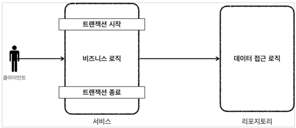
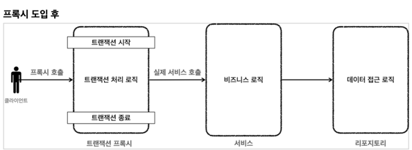
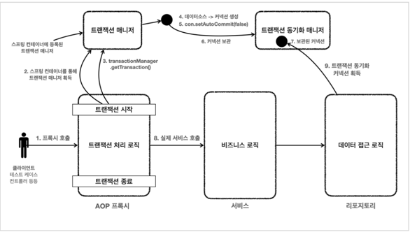
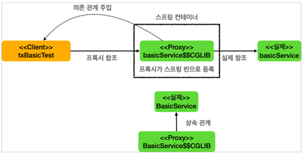

## 선언적 트랜잭션

- 트랜잭션 어노테이션을 붙이면 프록시 방식의 AOP가 적용된다.
> 프록시 도입 전


> 프록시 도입 후


> 전체 과정


## 프록시 방식의 AOP

- 트랜잭션 어노테이션이 붙어 있으면 트랜잭션 AOP는 대상 클래스의 프록시를 만들어 `스프링 컨테이너`에 등록한다.
- 그래서 빈을 주입받는 경우 프록시 객체가 주입되는 것이다.


#### 프록시 객체 테스트 코드
```java
@Test
    void proxyCheck() {
        log.info("aop class={}", basicService.getClass());
        assertThat(AopUtils.isAopProxy(basicService)).isTrue();
    }
```
- 결과(실제 BasicService 클래스가 아닌 CGLIB에 의해 만들어진 프록시 객체가 주입되는 것을 확인할 수 있다.)
```text
2023-10-04 01:41:31.166  INFO 3734 --- [    Test worker] hello.springtx.apply.TxBasicTest         : aop class=class hello.springtx.apply.TxBasicTest$BasicService$$EnhancerBySpringCGLIB$$562e918
```

#### 트랜잭션 시작, 종료 로그 찍기
```properties
logging.level.org.springframework.transaction.interceptor=TRACE
```

#### 트랜잭션 시작, 종료 테스트 코드
```java
    @Slf4j
    static class BasicService {
        
        @Transactional
        public void tx() {
            log.info("call tx");
            boolean txActive = TransactionSynchronizationManager.isActualTransactionActive();
            log.info("tx active={}", txActive);
        }

        public void nonTx() {
            log.info("call nonTx");
            boolean txActive = TransactionSynchronizationManager.isActualTransactionActive();
            log.info("tx active={}", txActive);
        }
    }
```

- 결과
```text
2023-10-04 01:44:05.416 TRACE 3775 --- [    Test worker] o.s.t.i.TransactionInterceptor           : Getting transaction for [hello.springtx.apply.TxBasicTest$BasicService.tx]
2023-10-04 01:44:05.419  INFO 3775 --- [    Test worker] h.s.apply.TxBasicTest$BasicService       : call tx
2023-10-04 01:44:05.419  INFO 3775 --- [    Test worker] h.s.apply.TxBasicTest$BasicService       : tx active=true
2023-10-04 01:44:05.420 TRACE 3775 --- [    Test worker] o.s.t.i.TransactionInterceptor           : Completing transaction for [hello.springtx.apply.TxBasicTest$BasicService.tx]
2023-10-04 01:44:05.421  INFO 3775 --- [    Test worker] h.s.apply.TxBasicTest$BasicService       : call nonTx
2023-10-04 01:44:05.421  INFO 3775 --- [    Test worker] h.s.apply.TxBasicTest$BasicService       : tx active=false
```

## 트랜잭션 적용 위치

- 항상 구체적이고 자세한 것이 높은 우선순위를 가진다.
- 메서드와 클래스가 있다면, 둘 중 메서드가 더 구체적인 것이다.

## 트랜잭션 읽기, 쓰기 옵션

#### 트랜잭션의 기본 옵션 값
- 트랜잭션의 기본 옵션은 `readOnly=false`이다.

#### 트랜잭션에 적용된 readOnly 옵션의 값을 반환
`TransactionSynchronizationManager.isCurrentTransactionReadOnly`