## 선언적 트랜잭션

- 트랜잭션 어노테이션을 붙이면 프록시 방식의 AOP가 적용된다.
> 프록시 도입 전


> 프록시 도입 후
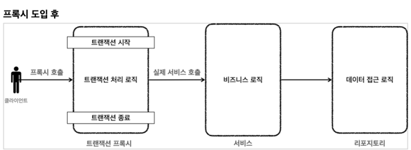

> 전체 과정
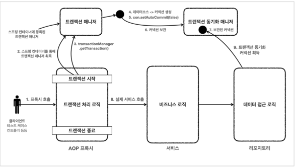

## 프록시 방식의 AOP

- 트랜잭션 어노테이션이 붙어 있으면 트랜잭션 AOP는 대상 클래스의 프록시를 만들어 `스프링 컨테이너`에 등록한다.
- 그래서 빈을 주입받는 경우 프록시 객체가 주입되는 것이다.
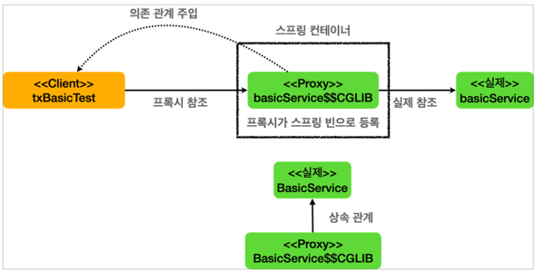

#### 프록시 객체 테스트 코드
```java
@Test
    void proxyCheck() {
        log.info("aop class={}", basicService.getClass());
        assertThat(AopUtils.isAopProxy(basicService)).isTrue();
    }
```
- 결과(실제 BasicService 클래스가 아닌 CGLIB에 의해 만들어진 프록시 객체가 주입되는 것을 확인할 수 있다.)
```text
2023-10-04 01:41:31.166  INFO 3734 --- [    Test worker] hello.springtx.apply.TxBasicTest         : aop class=class hello.springtx.apply.TxBasicTest$BasicService$$EnhancerBySpringCGLIB$$562e918
```

#### 트랜잭션 시작, 종료 로그 찍기
```properties
logging.level.org.springframework.transaction.interceptor=TRACE
```

#### 트랜잭션 시작, 종료 테스트 코드
```java
    @Slf4j
    static class BasicService {
        
        @Transactional
        public void tx() {
            log.info("call tx");
            boolean txActive = TransactionSynchronizationManager.isActualTransactionActive();
            log.info("tx active={}", txActive);
        }

        public void nonTx() {
            log.info("call nonTx");
            boolean txActive = TransactionSynchronizationManager.isActualTransactionActive();
            log.info("tx active={}", txActive);
        }
    }
```

- 결과
```text
2023-10-04 01:44:05.416 TRACE 3775 --- [    Test worker] o.s.t.i.TransactionInterceptor           : Getting transaction for [hello.springtx.apply.TxBasicTest$BasicService.tx]
2023-10-04 01:44:05.419  INFO 3775 --- [    Test worker] h.s.apply.TxBasicTest$BasicService       : call tx
2023-10-04 01:44:05.419  INFO 3775 --- [    Test worker] h.s.apply.TxBasicTest$BasicService       : tx active=true
2023-10-04 01:44:05.420 TRACE 3775 --- [    Test worker] o.s.t.i.TransactionInterceptor           : Completing transaction for [hello.springtx.apply.TxBasicTest$BasicService.tx]
2023-10-04 01:44:05.421  INFO 3775 --- [    Test worker] h.s.apply.TxBasicTest$BasicService       : call nonTx
2023-10-04 01:44:05.421  INFO 3775 --- [    Test worker] h.s.apply.TxBasicTest$BasicService       : tx active=false
```

## 트랜잭션 적용 위치

- 항상 구체적이고 자세한 것이 높은 우선순위를 가진다.
- 메서드와 클래스가 있다면, 둘 중 메서드가 더 구체적인 것이다.

## 트랜잭션 읽기, 쓰기 옵션

#### 트랜잭션의 기본 옵션 값
- 트랜잭션의 기본 옵션은 `readOnly=false`이다.

#### 트랜잭션에 적용된 readOnly 옵션의 값을 반환
`TransactionSynchronizationManager.isCurrentTransactionReadOnly`

## 트랜잭션 AOP 주의사항 - 프록시 내부 호출1

- 트랜잭션이 적용되려면 프록시 객체가 요청을 받아 트랜잭션을 처리하고 실제 객체를 호출해야 한다.
- 그런데 대상 객체의 내부에서 트랜잭션이 붙어있는 다른 메서드를 호출한다면 트랜잭션이 적용되지 않는다.

#### 내부 메서드 호출 시 트랜잭션 적용 여부 테스트 코드

```java
    static class CallService {

        public void external() {
            log.info("call external");
            printTxInfo();
            internal();
        }

        @Transactional
        public void internal() {
            log.info("call internal");
            printTxInfo();
        }

        private void printTxInfo() {
            boolean txActive = TransactionSynchronizationManager.isActualTransactionActive();
            log.info("tx active={}", txActive);
        }
    }
```

- 결과(`external()` 메서드를 호출하는 경우)
```text
2023-10-04 02:18:50.556  INFO 4355 --- [    Test worker] h.s.a.InternalCallV1Test$CallService     : call external
2023-10-04 02:18:50.556  INFO 4355 --- [    Test worker] h.s.a.InternalCallV1Test$CallService     : tx active=false
2023-10-04 02:18:50.556  INFO 4355 --- [    Test worker] h.s.a.InternalCallV1Test$CallService     : call internal
2023-10-04 02:18:50.556  INFO 4355 --- [    Test worker] h.s.a.InternalCallV1Test$CallService     : tx active=false
```

- `internal()` 메서드에는 트랜잭션이 적용되지 않고 있다.
- 이는 프록시 객체에서 `internal()` 메서드를 호출하지 않고 실제 객체에서 메서드를 호출하고 있기 때문이다.

#### 프록시 방식의 AOP 한계
- `@Transaction`를 사용하는 트랜잭션 AOP는 프록시를 사용한다. 그리고 프록시를 사용하면 메서드 내부 호출에 프록시를 적용할 수 없다.
- 이 문제를 해결하기 위해서는 `internal()` 메서드를 별도의 클래스로 분리시키는 것이 제일 간단한 방법 중 하나다.
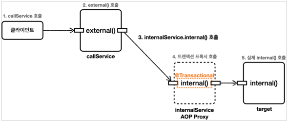

- 결과(외부 클래스의 `internal()`메서드를 호출하는 경우)
```text
2023-10-04 02:25:47.099  INFO 4591 --- [    Test worker] h.s.a.InternalCallV2Test$CallService     : call external
2023-10-04 02:25:47.100  INFO 4591 --- [    Test worker] h.s.a.InternalCallV2Test$CallService     : tx active=false

2023-10-04 02:25:47.147 TRACE 4591 --- [    Test worker] o.s.t.i.TransactionInterceptor           : Getting transaction for [hello.springtx.apply.InternalCallV2Test$InternalService.internal]
2023-10-04 02:25:47.153  INFO 4591 --- [    Test worker] h.s.a.InternalCallV2Test$InternalService : call internal
2023-10-04 02:25:47.154  INFO 4591 --- [    Test worker] h.s.a.InternalCallV2Test$InternalService : tx active=true
2023-10-04 02:25:47.154 TRACE 4591 --- [    Test worker] o.s.t.i.TransactionInterceptor           : Completing transaction for [hello.springtx.apply.InternalCallV2Test$InternalService.internal]
```

## 트랜잭션 AOP 주의 사항 - 초기화 시점

#### `@PostConstruct`와 `@Transactional`을 함께 사용
- `@PostConstruct`와 `@Transactional`을 함께 사용하면 트랜잭션이 적용되지 않는다.
- 초기화 코드가 먼저 호출되고, 그 다음에 트랜잭션 AOP가 적용된다. 따라서 초기화 시점에 해당 메서드에 대한 트랜잭션은 얻을 수 없다.
```java
        @PostConstruct
        @Transactional
        public void initV1() {
            boolean isActive = TransactionSynchronizationManager.isActualTransactionActive();
            log.info("Hello init @PostConstruct tx active={}", isActive);
        }
```

#### ApplicationReadyEvent 사용
```java
        @EventListener(value = ApplicationReadyEvent.class)
        @Transactional
        public void initV2() {
            boolean isActive = TransactionSynchronizationManager.isActualTransactionActive();
            log.info("Hello init ApplicationReadyEvent tx active={}", isActive);
        }
```

- 결과
```text
2023-10-04 03:14:45.018  INFO 5330 --- [    Test worker] hello.springtx.apply.InitTxTest$Hello    : Hello init @PostConstruct tx active=false

2023-10-04 03:14:45.119 TRACE 5330 --- [    Test worker] o.s.t.i.TransactionInterceptor           : Getting transaction for [hello.springtx.apply.InitTxTest$Hello.initV2]
2023-10-04 03:14:45.123  INFO 5330 --- [    Test worker] hello.springtx.apply.InitTxTest$Hello    : Hello init ApplicationReadyEvent tx active=true
2023-10-04 03:14:45.123 TRACE 5330 --- [    Test worker] o.s.t.i.TransactionInterceptor           : Completing transaction for [hello.springtx.apply.InitTxTest$Hello.initV2]
```

## 예외와 트랜잭션 커밋, 롤백 - 기본

#### 예외 발생 시 트랜잭션 AOP는 예외의 종류에 따라 트랜잭션을 커밋하거나 롤백한다.

- 언체크 예외(`RuntimeException`, `Error`)
  - 트랜잭션 롤백
- 체크 예외(`Exception`)
  - 트랜잭션 커밋

#### rollbackFor 옵션을 사용하여 체크 예외가 발생할 때 트랜잭션을 롤백하도록 설정
```java
    @Slf4j
    static class RollbackService {

        // 런타임 예외 발생: 롤백
        @Transactional
        public void runtimeException() {
            log.info("call runtimeException");
            throw new RuntimeException();
        }

        // 체크 예외 발생: 커밋
        @Transactional
        public void checkedException() throws MyException {
            log.info("call checkedException");
            throw new MyException();
        }

        // 체크 예외 rollbackFor 지정: 롤백
        @Transactional(rollbackFor = MyException.class)
        public void rollbackFor() throws MyException {
            log.info("call checkedException");
            throw new MyException();
        }
    }
```

- 결과 
- 런타임 예외
```text
2023-10-07 02:03:13.059 DEBUG 30444 --- [    Test worker] o.s.orm.jpa.JpaTransactionManager        : Creating new transaction with name [hello.springtx.exception.RollbackTest$RollbackService.runtimeException]: PROPAGATION_REQUIRED,ISOLATION_DEFAULT
2023-10-07 02:03:13.090 DEBUG 30444 --- [    Test worker] o.s.orm.jpa.JpaTransactionManager        : Opened new EntityManager [SessionImpl(427006214<open>)] for JPA transaction
2023-10-07 02:03:13.092 DEBUG 30444 --- [    Test worker] o.s.orm.jpa.JpaTransactionManager        : Exposing JPA transaction as JDBC [org.springframework.orm.jpa.vendor.HibernateJpaDialect$HibernateConnectionHandle@3815a7d1]
2023-10-07 02:03:13.092 TRACE 30444 --- [    Test worker] o.s.t.i.TransactionInterceptor           : Getting transaction for [hello.springtx.exception.RollbackTest$RollbackService.runtimeException]
2023-10-07 02:03:13.096  INFO 30444 --- [    Test worker] h.s.e.RollbackTest$RollbackService       : call runtimeException
2023-10-07 02:03:13.096 TRACE 30444 --- [    Test worker] o.s.t.i.TransactionInterceptor           : Completing transaction for [hello.springtx.exception.RollbackTest$RollbackService.runtimeException] after exception: java.lang.RuntimeException
2023-10-07 02:03:13.096 DEBUG 30444 --- [    Test worker] o.s.orm.jpa.JpaTransactionManager        : Initiating transaction rollback
2023-10-07 02:03:13.096 DEBUG 30444 --- [    Test worker] o.s.orm.jpa.JpaTransactionManager        : Rolling back JPA transaction on EntityManager [SessionImpl(427006214<open>)]
2023-10-07 02:03:13.097 DEBUG 30444 --- [    Test worker] o.s.orm.jpa.JpaTransactionManager        : Closing JPA EntityManager [SessionImpl(427006214<open>)] after transaction
```

- 체크 예외
```text
2023-10-07 02:04:07.933 DEBUG 30459 --- [    Test worker] o.s.orm.jpa.JpaTransactionManager        : Creating new transaction with name [hello.springtx.exception.RollbackTest$RollbackService.checkedException]: PROPAGATION_REQUIRED,ISOLATION_DEFAULT
2023-10-07 02:04:07.961 DEBUG 30459 --- [    Test worker] o.s.orm.jpa.JpaTransactionManager        : Opened new EntityManager [SessionImpl(427006214<open>)] for JPA transaction
2023-10-07 02:04:07.962 DEBUG 30459 --- [    Test worker] o.s.orm.jpa.JpaTransactionManager        : Exposing JPA transaction as JDBC [org.springframework.orm.jpa.vendor.HibernateJpaDialect$HibernateConnectionHandle@3815a7d1]
2023-10-07 02:04:07.963 TRACE 30459 --- [    Test worker] o.s.t.i.TransactionInterceptor           : Getting transaction for [hello.springtx.exception.RollbackTest$RollbackService.checkedException]
2023-10-07 02:04:07.966  INFO 30459 --- [    Test worker] h.s.e.RollbackTest$RollbackService       : call checkedException
2023-10-07 02:04:07.966 TRACE 30459 --- [    Test worker] o.s.t.i.TransactionInterceptor           : Completing transaction for [hello.springtx.exception.RollbackTest$RollbackService.checkedException] after exception: hello.springtx.exception.RollbackTest$MyException
2023-10-07 02:04:07.966 DEBUG 30459 --- [    Test worker] o.s.orm.jpa.JpaTransactionManager        : Initiating transaction commit
2023-10-07 02:04:07.966 DEBUG 30459 --- [    Test worker] o.s.orm.jpa.JpaTransactionManager        : Committing JPA transaction on EntityManager [SessionImpl(427006214<open>)]
2023-10-07 02:04:07.967 DEBUG 30459 --- [    Test worker] o.s.orm.jpa.JpaTransactionManager        : Closing JPA EntityManager [SessionImpl(427006214<open>)] after transaction
```

- `@Transactional(rollbackFor = MyException.class)`
```text
2023-10-07 02:04:55.479 DEBUG 30471 --- [    Test worker] o.s.orm.jpa.JpaTransactionManager        : Creating new transaction with name [hello.springtx.exception.RollbackTest$RollbackService.rollbackFor]: PROPAGATION_REQUIRED,ISOLATION_DEFAULT,-hello.springtx.exception.RollbackTest$MyException
2023-10-07 02:04:55.507 DEBUG 30471 --- [    Test worker] o.s.orm.jpa.JpaTransactionManager        : Opened new EntityManager [SessionImpl(329929969<open>)] for JPA transaction
2023-10-07 02:04:55.509 DEBUG 30471 --- [    Test worker] o.s.orm.jpa.JpaTransactionManager        : Exposing JPA transaction as JDBC [org.springframework.orm.jpa.vendor.HibernateJpaDialect$HibernateConnectionHandle@1d2d4d7a]
2023-10-07 02:04:55.509 TRACE 30471 --- [    Test worker] o.s.t.i.TransactionInterceptor           : Getting transaction for [hello.springtx.exception.RollbackTest$RollbackService.rollbackFor]
2023-10-07 02:04:55.513  INFO 30471 --- [    Test worker] h.s.e.RollbackTest$RollbackService       : call checkedException
2023-10-07 02:04:55.514 TRACE 30471 --- [    Test worker] o.s.t.i.TransactionInterceptor           : Completing transaction for [hello.springtx.exception.RollbackTest$RollbackService.rollbackFor] after exception: hello.springtx.exception.RollbackTest$MyException
2023-10-07 02:04:55.514 DEBUG 30471 --- [    Test worker] o.s.orm.jpa.JpaTransactionManager        : Initiating transaction rollback
2023-10-07 02:04:55.514 DEBUG 30471 --- [    Test worker] o.s.orm.jpa.JpaTransactionManager        : Rolling back JPA transaction on EntityManager [SessionImpl(329929969<open>)]
2023-10-07 02:04:55.515 DEBUG 30471 --- [    Test worker] o.s.orm.jpa.JpaTransactionManager        : Closing JPA EntityManager [SessionImpl(329929969<open>)] after transaction
```

## 예외와 트랜잭션 커밋, 롤백 - 활용

#### 왜 체크 예외는 커밋하고 언체크 예외는 롤백하는가?
- 스프링은 기본적으로 체크 예외는 비즈니스 의미가 있을 때 사용하고, 런타임 예외는 복구 불가능한 예외로 가정한다.
- 체크 예외
  - 비즈니스 의미가 있을 때 사용(시스템에는 문제가 없고 비즈니스 상황에 문제가 있는 예외이다.)
- 언체크 예외
  - 복구 불가능한 예외

#### 요구사항
> 주문을 하는데 상황에 따라 다음과 같이 조치한다.
> 1. 정상: 주문시 결제를 성공하면 주문 데이터를 저장하고 결제 상태를 완료 로 처리한다.
> 2. 시스템 예외: 주문시 내부에 복구 불가능한 예외가 발생하면 전체 데이터를 롤백한다.
> 3. 비즈니스 예외: 주문시 결제 잔고가 부족하면 주문 데이터를 저장하고, 결제 상태를 대기 로 처리한다. 이 경우 고객에게 잔고 부족을 알리고 별도의 계좌로 입금하도록 안내한다.

- 정상 주문
```text
2023-10-09 01:17:39.883 TRACE 39452 --- [    Test worker] o.s.t.i.TransactionInterceptor           : Getting transaction for [hello.springtx.order.OrderService.order]
2023-10-09 01:17:39.889  INFO 39452 --- [    Test worker] hello.springtx.order.OrderService        : order 호출
2023-10-09 01:17:39.890 DEBUG 39452 --- [    Test worker] o.s.orm.jpa.JpaTransactionManager        : Found thread-bound EntityManager [SessionImpl(1456947885<open>)] for JPA transaction
2023-10-09 01:17:39.891 DEBUG 39452 --- [    Test worker] o.s.orm.jpa.JpaTransactionManager        : Participating in existing transaction
2023-10-09 01:17:39.891 TRACE 39452 --- [    Test worker] o.s.t.i.TransactionInterceptor           : Getting transaction for [org.springframework.data.jpa.repository.support.SimpleJpaRepository.save]
2023-10-09 01:17:39.895 DEBUG 39452 --- [    Test worker] org.hibernate.SQL                        : call next value for hibernate_sequence
2023-10-09 01:17:39.919 TRACE 39452 --- [    Test worker] o.s.t.i.TransactionInterceptor           : Completing transaction for [org.springframework.data.jpa.repository.support.SimpleJpaRepository.save]
2023-10-09 01:17:39.919  INFO 39452 --- [    Test worker] hello.springtx.order.OrderService        : 결제 프로세스 진입
2023-10-09 01:17:39.919  INFO 39452 --- [    Test worker] hello.springtx.order.OrderService        : 정상 승인
2023-10-09 01:17:39.919  INFO 39452 --- [    Test worker] hello.springtx.order.OrderService        : 결제 프로세스 완료
2023-10-09 01:17:39.919 TRACE 39452 --- [    Test worker] o.s.t.i.TransactionInterceptor           : Completing transaction for [hello.springtx.order.OrderService.order]
2023-10-09 01:17:39.919 DEBUG 39452 --- [    Test worker] o.s.orm.jpa.JpaTransactionManager        : Initiating transaction commit
2023-10-09 01:17:39.919 DEBUG 39452 --- [    Test worker] o.s.orm.jpa.JpaTransactionManager        : Committing JPA transaction on EntityManager [SessionImpl(1456947885<open>)]
2023-10-09 01:17:39.924 DEBUG 39452 --- [    Test worker] org.hibernate.SQL                        : insert into orders (pay_status, username, id) values (?, ?, ?)
2023-10-09 01:17:39.926 DEBUG 39452 --- [    Test worker] org.hibernate.SQL                        : update orders set pay_status=?, username=? where id=?
```

 런타임 예외 발생(롤백)
```text
2023-10-09 01:18:32.953 TRACE 39467 --- [    Test worker] o.s.t.i.TransactionInterceptor           : Getting transaction for [org.springframework.data.jpa.repository.support.SimpleJpaRepository.save]
2023-10-09 01:18:32.958 DEBUG 39467 --- [    Test worker] org.hibernate.SQL                        : call next value for hibernate_sequence
2023-10-09 01:18:32.986 TRACE 39467 --- [    Test worker] o.s.t.i.TransactionInterceptor           : Completing transaction for [org.springframework.data.jpa.repository.support.SimpleJpaRepository.save]
2023-10-09 01:18:32.986  INFO 39467 --- [    Test worker] hello.springtx.order.OrderService        : 결제 프로세스 진입
2023-10-09 01:18:32.986  INFO 39467 --- [    Test worker] hello.springtx.order.OrderService        : 시스템 예외 발생
2023-10-09 01:18:32.986 TRACE 39467 --- [    Test worker] o.s.t.i.TransactionInterceptor           : Completing transaction for [hello.springtx.order.OrderService.order] after exception: java.lang.RuntimeException: 시스템 예외
2023-10-09 01:18:32.986 DEBUG 39467 --- [    Test worker] o.s.orm.jpa.JpaTransactionManager        : Initiating transaction rollback
2023-10-09 01:18:32.986 DEBUG 39467 --- [    Test worker] o.s.orm.jpa.JpaTransactionManager        : Rolling back JPA transaction on EntityManager [SessionImpl(448512468<open>)]
2023-10-09 01:18:32.987 DEBUG 39467 --- [    Test worker] o.s.orm.jpa.JpaTransactionManager        : Closing JPA EntityManager [SessionImpl(448512468<open>)] after transaction
2023-10-09 01:18:32.999 DEBUG 39467 --- [    Test worker] o.s.orm.jpa.JpaTransactionManager        : Creating new transaction with name [org.springframework.data.jpa.repository.support.SimpleJpaRepository.findById]: PROPAGATION_REQUIRED,ISOLATION_DEFAULT,readOnly
2023-10-09 01:18:33.000 DEBUG 39467 --- [    Test worker] o.s.orm.jpa.JpaTransactionManager        : Opened new EntityManager [SessionImpl(1200612373<open>)] for JPA transaction
2023-10-09 01:18:33.000 DEBUG 39467 --- [    Test worker] o.s.orm.jpa.JpaTransactionManager        : Exposing JPA transaction as JDBC [org.springframework.orm.jpa.vendor.HibernateJpaDialect$HibernateConnectionHandle@197180a5]
2023-10-09 01:18:33.000 TRACE 39467 --- [    Test worker] o.s.t.i.TransactionInterceptor           : Getting transaction for [org.springframework.data.jpa.repository.support.SimpleJpaRepository.findById]
2023-10-09 01:18:33.005 DEBUG 39467 --- [    Test worker] org.hibernate.SQL                        : select order0_.id as id1_0_0_, order0_.pay_status as pay_stat2_0_0_, order0_.username as username3_0_0_ from orders order0_ where order0_.id=?
2023-10-09 01:18:33.008 TRACE 39467 --- [    Test worker] o.s.t.i.TransactionInterceptor           : Completing transaction for [org.springframework.data.jpa.repository.support.SimpleJpaRepository.findById]
```

- 체크 예외(비즈니스 예외, 커밋) 
```text
2023-10-09 01:19:52.679 TRACE 39484 --- [    Test worker] o.s.t.i.TransactionInterceptor           : Getting transaction for [hello.springtx.order.OrderService.order]
2023-10-09 01:19:52.684  INFO 39484 --- [    Test worker] hello.springtx.order.OrderService        : order 호출
2023-10-09 01:19:52.686 DEBUG 39484 --- [    Test worker] o.s.orm.jpa.JpaTransactionManager        : Found thread-bound EntityManager [SessionImpl(1456947885<open>)] for JPA transaction
2023-10-09 01:19:52.686 DEBUG 39484 --- [    Test worker] o.s.orm.jpa.JpaTransactionManager        : Participating in existing transaction
2023-10-09 01:19:52.686 TRACE 39484 --- [    Test worker] o.s.t.i.TransactionInterceptor           : Getting transaction for [org.springframework.data.jpa.repository.support.SimpleJpaRepository.save]
2023-10-09 01:19:52.691 DEBUG 39484 --- [    Test worker] org.hibernate.SQL                        : call next value for hibernate_sequence
2023-10-09 01:19:52.712 TRACE 39484 --- [    Test worker] o.s.t.i.TransactionInterceptor           : Completing transaction for [org.springframework.data.jpa.repository.support.SimpleJpaRepository.save]
2023-10-09 01:19:52.712  INFO 39484 --- [    Test worker] hello.springtx.order.OrderService        : 결제 프로세스 진입
2023-10-09 01:19:52.712  INFO 39484 --- [    Test worker] hello.springtx.order.OrderService        : 잔고 부족 비즈니스 예외 발생
2023-10-09 01:19:52.712 TRACE 39484 --- [    Test worker] o.s.t.i.TransactionInterceptor           : Completing transaction for [hello.springtx.order.OrderService.order] after exception: hello.springtx.order.NotEnoughMoneyException: 잔고가 부족합니다.
2023-10-09 01:19:52.713 DEBUG 39484 --- [    Test worker] o.s.orm.jpa.JpaTransactionManager        : Initiating transaction commit
2023-10-09 01:19:52.713 DEBUG 39484 --- [    Test worker] o.s.orm.jpa.JpaTransactionManager        : Committing JPA transaction on EntityManager [SessionImpl(1456947885<open>)]
2023-10-09 01:19:52.717 DEBUG 39484 --- [    Test worker] org.hibernate.SQL                        : insert into orders (pay_status, username, id) values (?, ?, ?)
2023-10-09 01:19:52.719 DEBUG 39484 --- [    Test worker] org.hibernate.SQL                        : update orders set pay_status=?, username=? where id=?
2023-10-09 01:19:52.721 DEBUG 39484 --- [    Test worker] o.s.orm.jpa.JpaTransactionManager        : Closing JPA EntityManager [SessionImpl(1456947885<open>)] after transaction
2023-10-09 01:19:52.721  INFO 39484 --- [    Test worker] hello.springtx.order.OrderServiceTest    : 고객에게 잔고 부족을 알리고 별도의 계좌로 입금하도록 안내
```

## 스프링 트랜잭션 전파1 - 커밋, 롤백

- 트랜잭션 획득 후 커밋
```java
    @Test
    void commit() {
        log.info("트랜잭션 시작");
        TransactionStatus status = txManager.getTransaction(new DefaultTransactionAttribute());

        log.info("트랜잭션 커밋 시작");
        txManager.commit(status);
        log.info("트랜잭션 커밋 완료");
    }
```

- 결과
```text
2023-10-09 01:35:42.842  INFO 39820 --- [    Test worker] hello.springtx.propogation.BasicTxTest   : 트랜잭션 시작
2023-10-09 01:35:42.843 DEBUG 39820 --- [    Test worker] o.s.j.d.DataSourceTransactionManager     : Creating new transaction with name [null]: PROPAGATION_REQUIRED,ISOLATION_DEFAULT
2023-10-09 01:35:42.843 DEBUG 39820 --- [    Test worker] o.s.j.d.DataSourceTransactionManager     : Acquired Connection [HikariProxyConnection@210158726 wrapping conn0: url=jdbc:h2:mem:898ca3c7-2d7b-479e-a521-b9385e70ac39 user=SA] for JDBC transaction
2023-10-09 01:35:42.844 DEBUG 39820 --- [    Test worker] o.s.j.d.DataSourceTransactionManager     : Switching JDBC Connection [HikariProxyConnection@210158726 wrapping conn0: url=jdbc:h2:mem:898ca3c7-2d7b-479e-a521-b9385e70ac39 user=SA] to manual commit
2023-10-09 01:35:42.844  INFO 39820 --- [    Test worker] hello.springtx.propogation.BasicTxTest   : 트랜잭션 커밋 시작
2023-10-09 01:35:42.844 DEBUG 39820 --- [    Test worker] o.s.j.d.DataSourceTransactionManager     : Initiating transaction commit
2023-10-09 01:35:42.845 DEBUG 39820 --- [    Test worker] o.s.j.d.DataSourceTransactionManager     : Committing JDBC transaction on Connection [HikariProxyConnection@210158726 wrapping conn0: url=jdbc:h2:mem:898ca3c7-2d7b-479e-a521-b9385e70ac39 user=SA]
2023-10-09 01:35:42.845 DEBUG 39820 --- [    Test worker] o.s.j.d.DataSourceTransactionManager     : Releasing JDBC Connection [HikariProxyConnection@210158726 wrapping conn0: url=jdbc:h2:mem:898ca3c7-2d7b-479e-a521-b9385e70ac39 user=SA] after transaction
2023-10-09 01:35:42.845  INFO 39820 --- [    Test worker] hello.springtx.propogation.BasicTxTest   : 트랜잭션 커밋 완료
```

- 트랜잭션 획득 후 롤백
```java
    @Test
    void rollback() {
        log.info("트랜잭션 시작");
        TransactionStatus status = txManager.getTransaction(new DefaultTransactionAttribute());

        log.info("트랜잭션 롤백 시작");
        txManager.rollback(status);
        log.info("트랜잭션 롤백 완료");
    }
```

- 결과
```text
2023-10-09 01:36:09.332  INFO 39829 --- [    Test worker] hello.springtx.propogation.BasicTxTest   : 트랜잭션 시작
2023-10-09 01:36:09.332 DEBUG 39829 --- [    Test worker] o.s.j.d.DataSourceTransactionManager     : Creating new transaction with name [null]: PROPAGATION_REQUIRED,ISOLATION_DEFAULT
2023-10-09 01:36:09.333 DEBUG 39829 --- [    Test worker] o.s.j.d.DataSourceTransactionManager     : Acquired Connection [HikariProxyConnection@1688786293 wrapping conn0: url=jdbc:h2:mem:bb802044-3985-45f0-8e29-7a6bd92807a2 user=SA] for JDBC transaction
2023-10-09 01:36:09.333 DEBUG 39829 --- [    Test worker] o.s.j.d.DataSourceTransactionManager     : Switching JDBC Connection [HikariProxyConnection@1688786293 wrapping conn0: url=jdbc:h2:mem:bb802044-3985-45f0-8e29-7a6bd92807a2 user=SA] to manual commit
2023-10-09 01:36:09.333  INFO 39829 --- [    Test worker] hello.springtx.propogation.BasicTxTest   : 트랜잭션 롤백 시작
2023-10-09 01:36:09.333 DEBUG 39829 --- [    Test worker] o.s.j.d.DataSourceTransactionManager     : Initiating transaction rollback
2023-10-09 01:36:09.333 DEBUG 39829 --- [    Test worker] o.s.j.d.DataSourceTransactionManager     : Rolling back JDBC transaction on Connection [HikariProxyConnection@1688786293 wrapping conn0: url=jdbc:h2:mem:bb802044-3985-45f0-8e29-7a6bd92807a2 user=SA]
2023-10-09 01:36:09.333 DEBUG 39829 --- [    Test worker] o.s.j.d.DataSourceTransactionManager     : Releasing JDBC Connection [HikariProxyConnection@1688786293 wrapping conn0: url=jdbc:h2:mem:bb802044-3985-45f0-8e29-7a6bd92807a2 user=SA] after transaction
2023-10-09 01:36:09.333  INFO 39829 --- [    Test worker] hello.springtx.propogation.BasicTxTest   : 트랜잭션 롤백 완료
```

## 스프링 트랜잭션 전파2 - 트랜잭션 두 번 사용

- 각각의 트랜잭션이 시작되면 서로에게 영향이 없다.
```java
    @Test
    void double_commit_rollback() {
        log.info("트랜잭션1 시작");
        TransactionStatus tx1 = txManager.getTransaction(new DefaultTransactionAttribute());
        log.info("트랜잭션1 커밋");
        txManager.commit(tx1);

        log.info("트랜잭션2 시작");
        TransactionStatus tx2 = txManager.getTransaction(new DefaultTransactionAttribute());
        log.info("트랜잭션2 롤백");
        txManager.rollback(tx2);
    }
```

- 결과
```text
2023-10-09 17:48:42.132  INFO 46554 --- [           main] hello.springtx.propogation.BasicTxTest   : 트랜잭션1 시작
2023-10-09 17:48:42.132 DEBUG 46554 --- [           main] o.s.j.d.DataSourceTransactionManager     : Creating new transaction with name [null]: PROPAGATION_REQUIRED,ISOLATION_DEFAULT
2023-10-09 17:48:42.133 DEBUG 46554 --- [           main] o.s.j.d.DataSourceTransactionManager     : Acquired Connection [HikariProxyConnection@2034388773 wrapping conn0: url=jdbc:h2:mem:1e9af37d-dec6-41cf-a33c-1625aea75801 user=SA] for JDBC transaction
2023-10-09 17:48:42.133 DEBUG 46554 --- [           main] o.s.j.d.DataSourceTransactionManager     : Switching JDBC Connection [HikariProxyConnection@2034388773 wrapping conn0: url=jdbc:h2:mem:1e9af37d-dec6-41cf-a33c-1625aea75801 user=SA] to manual commit
2023-10-09 17:48:42.133  INFO 46554 --- [           main] hello.springtx.propogation.BasicTxTest   : 트랜잭션1 커밋
2023-10-09 17:48:42.133 DEBUG 46554 --- [           main] o.s.j.d.DataSourceTransactionManager     : Initiating transaction commit
2023-10-09 17:48:42.133 DEBUG 46554 --- [           main] o.s.j.d.DataSourceTransactionManager     : Committing JDBC transaction on Connection [HikariProxyConnection@2034388773 wrapping conn0: url=jdbc:h2:mem:1e9af37d-dec6-41cf-a33c-1625aea75801 user=SA]
2023-10-09 17:48:42.133 DEBUG 46554 --- [           main] o.s.j.d.DataSourceTransactionManager     : Releasing JDBC Connection [HikariProxyConnection@2034388773 wrapping conn0: url=jdbc:h2:mem:1e9af37d-dec6-41cf-a33c-1625aea75801 user=SA] after transaction
2023-10-09 17:48:42.134  INFO 46554 --- [           main] hello.springtx.propogation.BasicTxTest   : 트랜잭션2 시작
2023-10-09 17:48:42.134 DEBUG 46554 --- [           main] o.s.j.d.DataSourceTransactionManager     : Creating new transaction with name [null]: PROPAGATION_REQUIRED,ISOLATION_DEFAULT
2023-10-09 17:48:42.134 DEBUG 46554 --- [           main] o.s.j.d.DataSourceTransactionManager     : Acquired Connection [HikariProxyConnection@1607788159 wrapping conn0: url=jdbc:h2:mem:1e9af37d-dec6-41cf-a33c-1625aea75801 user=SA] for JDBC transaction
2023-10-09 17:48:42.134 DEBUG 46554 --- [           main] o.s.j.d.DataSourceTransactionManager     : Switching JDBC Connection [HikariProxyConnection@1607788159 wrapping conn0: url=jdbc:h2:mem:1e9af37d-dec6-41cf-a33c-1625aea75801 user=SA] to manual commit
2023-10-09 17:48:42.135  INFO 46554 --- [           main] hello.springtx.propogation.BasicTxTest   : 트랜잭션2 롤백
2023-10-09 17:48:42.135 DEBUG 46554 --- [           main] o.s.j.d.DataSourceTransactionManager     : Initiating transaction rollback
2023-10-09 17:48:42.135 DEBUG 46554 --- [           main] o.s.j.d.DataSourceTransactionManager     : Rolling back JDBC transaction on Connection [HikariProxyConnection@1607788159 wrapping conn0: url=jdbc:h2:mem:1e9af37d-dec6-41cf-a33c-1625aea75801 user=SA]
2023-10-09 17:48:42.135 DEBUG 46554 --- [           main] o.s.j.d.DataSourceTransactionManager     : Releasing JDBC Connection [HikariProxyConnection@1607788159 wrapping conn0: url=jdbc:h2:mem:1e9af37d-dec6-41cf-a33c-1625aea75801 user=SA] after transaction
```

> [!NOTE]
> 
> 로그를 살펴보면 트랜잭션1, 2 모두 동일한 `conn0` 커넥션을 사용하고 있다. 
> 이 둘은 서로 다른 커넥션으로 구분되어야 한다. 
> 따라서 히카리 커넥션 풀에서 커넥션을 획득하면 실제 커넥션을 그대로 반환하지 않고, 내부 관리를 위해 히카리 프록시 커넥션 객체를 생성해서 반환한다. 
> 이렇게 프록시 객체의 주소를 통해 동일한 커넥션을 따로 사용하는 것처럼 구분지을 수 있는 것이다.

## 스프링 트랜잭션 전파3 - 전파 기본

#### 외부 트랜잭션이 수행중인데, 내부 트랜잭션이 추가로 수행되는 경우
- 스프링은 이 경우 외부 기본적으로 트랜잭션과 내부 트랜잭션을 묶어서 하나의 트랜잭션을 만들어 준다.
- 스프링은 이 경우 이해를 돕기 위해 논리/물리 트랜잭션 개념을 분리하여 설명한다. 
- `물리 트랜잭션`
  - 실제 DB에 적용되는 트랜잭션을 의미한다.
- `논리 트랜잭션`
  - 하나의 물리 트랜잭션으로 묶인 트랜잭션을 의미한다.
  
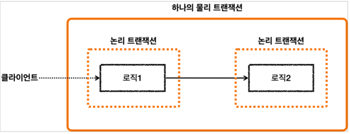

> [!IMPORTANT]
> 
> 모든 논리 트랜잭션이 커밋되어야 물리 트랜잭션이 커밋된다.
> 하나의 논리 트랜잭션이라도 롤백되면 물리 트랜잭션은 롤백된다.

## 스프링 트랜잭션 전파4 - 전파 예제

#### 요청 흐름
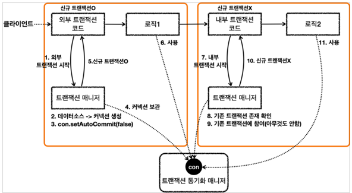

#### 응답 흐름
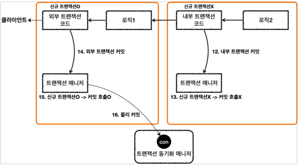

- 결과
```text
2023-10-09 19:29:01.317  INFO 47493 --- [    Test worker] hello.springtx.propogation.BasicTxTest   : 외부 트랜잭션 시작
2023-10-09 19:29:01.319 DEBUG 47493 --- [    Test worker] o.s.j.d.DataSourceTransactionManager     : Creating new transaction with name [null]: PROPAGATION_REQUIRED,ISOLATION_DEFAULT
2023-10-09 19:29:01.319 DEBUG 47493 --- [    Test worker] o.s.j.d.DataSourceTransactionManager     : Acquired Connection [HikariProxyConnection@677726975 wrapping conn0: url=jdbc:h2:mem:ae3e24c9-b0dc-43e1-8474-ef435f000ce0 user=SA] for JDBC transaction
2023-10-09 19:29:01.320 DEBUG 47493 --- [    Test worker] o.s.j.d.DataSourceTransactionManager     : Switching JDBC Connection [HikariProxyConnection@677726975 wrapping conn0: url=jdbc:h2:mem:ae3e24c9-b0dc-43e1-8474-ef435f000ce0 user=SA] to manual commit
2023-10-09 19:29:01.320  INFO 47493 --- [    Test worker] hello.springtx.propogation.BasicTxTest   : outer.isNewTransaction() = true
2023-10-09 19:29:01.320  INFO 47493 --- [    Test worker] hello.springtx.propogation.BasicTxTest   : 내부 트랜잭션 시작
2023-10-09 19:29:01.320 DEBUG 47493 --- [    Test worker] o.s.j.d.DataSourceTransactionManager     : Participating in existing transaction  // 신규 트랜잭션이 존재하는 경우 참여만 한다.
2023-10-09 19:29:01.320  INFO 47493 --- [    Test worker] hello.springtx.propogation.BasicTxTest   : inner.isNewTransaction() = false
2023-10-09 19:29:01.320  INFO 47493 --- [    Test worker] hello.springtx.propogation.BasicTxTest   : 내부 트랜잭션 커밋  // 내부 트랜잭션이 커밋되어도 실제 물리 트랜잭션에 커밋이 되지 않는다.
2023-10-09 19:29:01.320  INFO 47493 --- [    Test worker] hello.springtx.propogation.BasicTxTest   : 외부 트랜잭션 커밋  
2023-10-09 19:29:01.320 DEBUG 47493 --- [    Test worker] o.s.j.d.DataSourceTransactionManager     : Initiating transaction commit
2023-10-09 19:29:01.320 DEBUG 47493 --- [    Test worker] o.s.j.d.DataSourceTransactionManager     : Committing JDBC transaction on Connection [HikariProxyConnection@677726975 wrapping conn0: url=jdbc:h2:mem:ae3e24c9-b0dc-43e1-8474-ef435f000ce0 user=SA]
2023-10-09 19:29:01.320 DEBUG 47493 --- [    Test worker] o.s.j.d.DataSourceTransactionManager     : Releasing JDBC Connection [HikariProxyConnection@677726975 wrapping conn0: url=jdbc:h2:mem:ae3e24c9-b0dc-43e1-8474-ef435f000ce0 user=SA] after transaction
```

> [!IMPORTANT]
>
> 트랜잭션 매니저에 커밋을 호출한다고 항상 실제 커넥션에 물리 커밋이 발생하지 않는다.
> 신규 트랜잭션인 경우에만 실제 물리 커넥션을 사용해서 물리 커밋과 롤백을 수행한다.
> 신규 트랜잭션이 아니라면 실제 물리 커넥션을 사용하지 않는다.
> 따라서 내부 트랜잭션이 추가로 사용되면, 트랜잭션 매니저를 통해 논리 트랜잭션을 관리하고 모든 논리 트랜잭션이 커밋되어야 물리 트랜잭션이 커밋되는 것이다.

## 스프링 트랜잭션 전파5 - 외부 롤백

- 논리 트랜잭션이 하나라도 롤백되면 전체 물리 트랜잭션은 롤백된다.
- 앞서 봤듯이 외부 트랜잭션에서 시작한 물리 트랜잭션의 범위는 내부 트랜잭션까지 사용되므로, 외부 트랜잭션이 롤백되면 모든 내부 트랜잭션도 롤백된다.

#### 응답 흐름
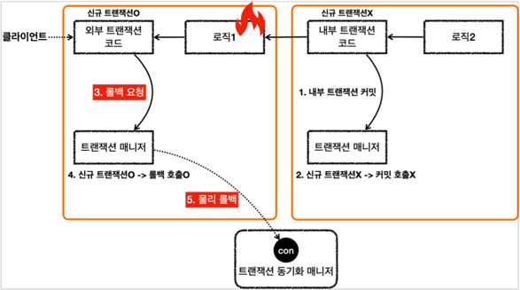

## 스프링 트랜잭션 전파5 - 내부 롤백

- 내부 트랜잭션이 롤백되면 해당 트랜잭션은 외부 트랜잭션에 `rollback-only` 마크를 트랜잭션 동기화 매니저에 기록한다.
```text
2023-10-09 22:15:18.220 DEBUG 49945 --- [    Test worker] o.s.j.d.DataSourceTransactionManager     : Participating transaction failed - marking existing transaction as rollback-only
```

- 트랜잭션 매니저는 신규 트랜잭션인 경우 실제 커넥션에 커밋을 호출한다. 이때 트랜잭션 동기화 매니저에 롤백 전용(`rollback-only`)마크가 있는지 확인하다.
- 시스템 입장에서는 커밋을 호출했지만 롤백되었다는 사실을 분명하게 알려줘야 한다.
- 스프링은 이 경우 `UnexpectedRollbackException` 런타임 예외를 던져 커밋을 시도했지만 예상치 못한 롤백이 발생했음을 알린다.

- 결과
```text
2023-10-09 22:15:18.218  INFO 49945 --- [    Test worker] hello.springtx.propogation.BasicTxTest   : 외부 트랜잭션 시작
2023-10-09 22:15:18.219 DEBUG 49945 --- [    Test worker] o.s.j.d.DataSourceTransactionManager     : Creating new transaction with name [null]: PROPAGATION_REQUIRED,ISOLATION_DEFAULT
2023-10-09 22:15:18.219 DEBUG 49945 --- [    Test worker] o.s.j.d.DataSourceTransactionManager     : Acquired Connection [HikariProxyConnection@694943195 wrapping conn0: url=jdbc:h2:mem:f8497e3a-b856-41ac-bf41-371c2e3df9e4 user=SA] for JDBC transaction
2023-10-09 22:15:18.220 DEBUG 49945 --- [    Test worker] o.s.j.d.DataSourceTransactionManager     : Switching JDBC Connection [HikariProxyConnection@694943195 wrapping conn0: url=jdbc:h2:mem:f8497e3a-b856-41ac-bf41-371c2e3df9e4 user=SA] to manual commit
2023-10-09 22:15:18.220  INFO 49945 --- [    Test worker] hello.springtx.propogation.BasicTxTest   : outer.isNewTransaction() = true
2023-10-09 22:15:18.220  INFO 49945 --- [    Test worker] hello.springtx.propogation.BasicTxTest   : 내부 트랜잭션 시작
2023-10-09 22:15:18.220 DEBUG 49945 --- [    Test worker] o.s.j.d.DataSourceTransactionManager     : Participating in existing transaction
2023-10-09 22:15:18.220  INFO 49945 --- [    Test worker] hello.springtx.propogation.BasicTxTest   : inner.isNewTransaction() = false
2023-10-09 22:15:18.220  INFO 49945 --- [    Test worker] hello.springtx.propogation.BasicTxTest   : 내부 트랜잭션 롤백
2023-10-09 22:15:18.220 DEBUG 49945 --- [    Test worker] o.s.j.d.DataSourceTransactionManager     : Participating transaction failed - marking existing transaction as rollback-only
2023-10-09 22:15:18.220 DEBUG 49945 --- [    Test worker] o.s.j.d.DataSourceTransactionManager     : Setting JDBC transaction [HikariProxyConnection@694943195 wrapping conn0: url=jdbc:h2:mem:f8497e3a-b856-41ac-bf41-371c2e3df9e4 user=SA] rollback-only
2023-10-09 22:15:18.220  INFO 49945 --- [    Test worker] hello.springtx.propogation.BasicTxTest   : 외부 트랜잭션 커밋
2023-10-09 22:15:18.242 DEBUG 49945 --- [    Test worker] o.s.j.d.DataSourceTransactionManager     : Global transaction is marked as rollback-only but transactional code requested commit
2023-10-09 22:15:18.242 DEBUG 49945 --- [    Test worker] o.s.j.d.DataSourceTransactionManager     : Initiating transaction rollback
2023-10-09 22:15:18.242 DEBUG 49945 --- [    Test worker] o.s.j.d.DataSourceTransactionManager     : Rolling back JDBC transaction on Connection [HikariProxyConnection@694943195 wrapping conn0: url=jdbc:h2:mem:f8497e3a-b856-41ac-bf41-371c2e3df9e4 user=SA]
2023-10-09 22:15:18.243 DEBUG 49945 --- [    Test worker] o.s.j.d.DataSourceTransactionManager     : Releasing JDBC Connection [HikariProxyConnection@694943195 wrapping conn0: url=jdbc:h2:mem:f8497e3a-b856-41ac-bf41-371c2e3df9e4 user=SA] after transaction
```

## 스프링 트랜잭션 전파7 - REQUIRES_NEW

#### 요청 흐름
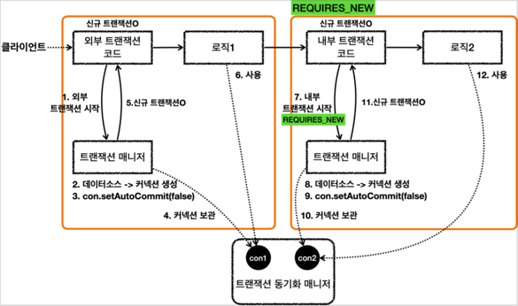

#### 응답 흐름
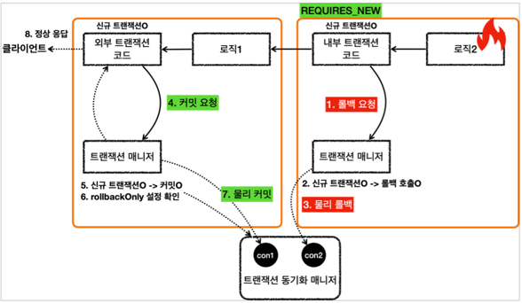

- 테스트
```java
log.info("내부 트랜잭션 시작");
DefaultTransactionAttribute definition = new DefaultTransactionAttribute();
definition.setPropagationBehavior(TransactionDefinition.PROPAGATION_REQUIRES_NEW);
TransactionStatus inner = txManager.getTransaction(definition);
log.info("inner.isNewTransaction() = {}", inner.isNewTransaction());  // true
log.info("내부 트랜잭션 롤백");
txManager.rollback(inner);
```

- 결과
```text
2023-10-09 22:29:18.158  INFO 50261 --- [    Test worker] hello.springtx.propogation.BasicTxTest   : 외부 트랜잭션 시작
2023-10-09 22:29:18.159 DEBUG 50261 --- [    Test worker] o.s.j.d.DataSourceTransactionManager     : Creating new transaction with name [null]: PROPAGATION_REQUIRED,ISOLATION_DEFAULT
2023-10-09 22:29:18.159 DEBUG 50261 --- [    Test worker] o.s.j.d.DataSourceTransactionManager     : Acquired Connection [HikariProxyConnection@181211485 wrapping conn0: url=jdbc:h2:mem:c1b7c09b-2d41-468e-ba48-13c43218bc6b user=SA] for JDBC transaction
2023-10-09 22:29:18.160 DEBUG 50261 --- [    Test worker] o.s.j.d.DataSourceTransactionManager     : Switching JDBC Connection [HikariProxyConnection@181211485 wrapping conn0: url=jdbc:h2:mem:c1b7c09b-2d41-468e-ba48-13c43218bc6b user=SA] to manual commit
2023-10-09 22:29:18.160  INFO 50261 --- [    Test worker] hello.springtx.propogation.BasicTxTest   : outer.isNewTransaction() = true
2023-10-09 22:29:18.160  INFO 50261 --- [    Test worker] hello.springtx.propogation.BasicTxTest   : 내부 트랜잭션 시작
2023-10-09 22:29:18.160 DEBUG 50261 --- [    Test worker] o.s.j.d.DataSourceTransactionManager     : Suspending current transaction, creating new transaction with name [null]
2023-10-09 22:29:18.160 DEBUG 50261 --- [    Test worker] o.s.j.d.DataSourceTransactionManager     : Acquired Connection [HikariProxyConnection@581639050 wrapping conn1: url=jdbc:h2:mem:c1b7c09b-2d41-468e-ba48-13c43218bc6b user=SA] for JDBC transaction
2023-10-09 22:29:18.160 DEBUG 50261 --- [    Test worker] o.s.j.d.DataSourceTransactionManager     : Switching JDBC Connection [HikariProxyConnection@581639050 wrapping conn1: url=jdbc:h2:mem:c1b7c09b-2d41-468e-ba48-13c43218bc6b user=SA] to manual commit
2023-10-09 22:29:18.161  INFO 50261 --- [    Test worker] hello.springtx.propogation.BasicTxTest   : inner.isNewTransaction() = true
2023-10-09 22:29:18.161  INFO 50261 --- [    Test worker] hello.springtx.propogation.BasicTxTest   : 내부 트랜잭션 롤백
2023-10-09 22:29:18.161 DEBUG 50261 --- [    Test worker] o.s.j.d.DataSourceTransactionManager     : Initiating transaction rollback
2023-10-09 22:29:18.161 DEBUG 50261 --- [    Test worker] o.s.j.d.DataSourceTransactionManager     : Rolling back JDBC transaction on Connection [HikariProxyConnection@581639050 wrapping conn1: url=jdbc:h2:mem:c1b7c09b-2d41-468e-ba48-13c43218bc6b user=SA]
2023-10-09 22:29:18.161 DEBUG 50261 --- [    Test worker] o.s.j.d.DataSourceTransactionManager     : Releasing JDBC Connection [HikariProxyConnection@581639050 wrapping conn1: url=jdbc:h2:mem:c1b7c09b-2d41-468e-ba48-13c43218bc6b user=SA] after transaction
2023-10-09 22:29:18.161 DEBUG 50261 --- [    Test worker] o.s.j.d.DataSourceTransactionManager     : Resuming suspended transaction after completion of inner transaction
2023-10-09 22:29:18.161  INFO 50261 --- [    Test worker] hello.springtx.propogation.BasicTxTest   : 외부 트랜잭션 커밋
2023-10-09 22:29:18.161 DEBUG 50261 --- [    Test worker] o.s.j.d.DataSourceTransactionManager     : Initiating transaction commit
2023-10-09 22:29:18.161 DEBUG 50261 --- [    Test worker] o.s.j.d.DataSourceTransactionManager     : Committing JDBC transaction on Connection [HikariProxyConnection@181211485 wrapping conn0: url=jdbc:h2:mem:c1b7c09b-2d41-468e-ba48-13c43218bc6b user=SA]
2023-10-09 22:29:18.161 DEBUG 50261 --- [    Test worker] o.s.j.d.DataSourceTransactionManager     : Releasing JDBC Connection [HikariProxyConnection@181211485 wrapping conn0: url=jdbc:h2:mem:c1b7c09b-2d41-468e-ba48-13c43218bc6b user=SA] after transaction
```

- 외부/내부 트랜잭션이 서로 다른 물리 커넥션을 획득하고 각각의 트랜잭션을 사용하고 있다.
- `REQUIRES_NEW` 옵션으로 외부 트랜잭션과 내부 트랜잭션을 완전히 분리해서 각각 별도의 물리 트랜잭션으로 사용할 수 있다.
- 새로운 트랜잭션을 호출하면서 `conn1`은 보류되고 새로운 `conn2`를 내부 트랜잭션이 완료될 때까지 사용된다.

> [!NOTE]
> 
> `REQUIRES_NEW` 옵션을 사용할 경우, 실제 DB 커넥션을 동시에 2개 사용하고 있다.
> 따라서 성능이 중요하거나 트래픽이 몰리는 경우 커넥션의 수가 부족하여 장애가 발생할 수도 있으니 조심해야 한다.

## 트랜잭션 전파 활용2 - 커밋, 롤백

#### Service: Transaction Off, Repository: Transaction On
- 따라서 회원을 저장할 때, 로그를 저장할 때 서로 다른 별도의 트랜잭션 안에서 동작한다.
- 로그를 저장할 때 예외가 발생하더라도 회원정보는 롤백되지 않고 저장된다.

- 결과
```text
2023-10-10 18:55:10.577  INFO 60817 --- [    Test worker] h.springtx.propogation.MemberService     : == memberRepository 호출 시작 ==
2023-10-10 18:55:10.579 DEBUG 60817 --- [    Test worker] o.s.orm.jpa.JpaTransactionManager        : Creating new transaction with name [hello.springtx.propogation.MemberRepository.save]: PROPAGATION_REQUIRED,ISOLATION_DEFAULT
2023-10-10 18:55:10.580 DEBUG 60817 --- [    Test worker] o.s.orm.jpa.JpaTransactionManager        : Opened new EntityManager [SessionImpl(1846735756<open>)] for JPA transaction
2023-10-10 18:55:10.581 DEBUG 60817 --- [    Test worker] o.s.orm.jpa.JpaTransactionManager        : Exposing JPA transaction as JDBC [org.springframework.orm.jpa.vendor.HibernateJpaDialect$HibernateConnectionHandle@38197e82]
2023-10-10 18:55:10.581 TRACE 60817 --- [    Test worker] o.s.t.i.TransactionInterceptor           : Getting transaction for [hello.springtx.propogation.MemberRepository.save]
2023-10-10 18:55:10.586  INFO 60817 --- [    Test worker] h.springtx.propogation.MemberRepository  : member 저장
2023-10-10 18:55:10.588 DEBUG 60817 --- [    Test worker] org.hibernate.SQL                        : call next value for hibernate_sequence
2023-10-10 18:55:10.614 TRACE 60817 --- [    Test worker] o.s.t.i.TransactionInterceptor           : Completing transaction for [hello.springtx.propogation.MemberRepository.save]
2023-10-10 18:55:10.615 DEBUG 60817 --- [    Test worker] o.s.orm.jpa.JpaTransactionManager        : Initiating transaction commit
2023-10-10 18:55:10.615 DEBUG 60817 --- [    Test worker] o.s.orm.jpa.JpaTransactionManager        : Committing JPA transaction on EntityManager [SessionImpl(1846735756<open>)]
2023-10-10 18:55:10.622 DEBUG 60817 --- [    Test worker] org.hibernate.SQL                        : insert into member (username, id) values (?, ?)
2023-10-10 18:55:10.627 DEBUG 60817 --- [    Test worker] o.s.orm.jpa.JpaTransactionManager        : Closing JPA EntityManager [SessionImpl(1846735756<open>)] after transaction
2023-10-10 18:55:10.628  INFO 60817 --- [    Test worker] h.springtx.propogation.MemberService     : == memberRepository 호출 종료 ==
2023-10-10 18:55:10.628  INFO 60817 --- [    Test worker] h.springtx.propogation.MemberService     : == logRepository 호출 시작 ==
2023-10-10 18:55:10.628 DEBUG 60817 --- [    Test worker] o.s.orm.jpa.JpaTransactionManager        : Creating new transaction with name [hello.springtx.propogation.LogRepository.save]: PROPAGATION_REQUIRED,ISOLATION_DEFAULT
2023-10-10 18:55:10.628 DEBUG 60817 --- [    Test worker] o.s.orm.jpa.JpaTransactionManager        : Opened new EntityManager [SessionImpl(1427350635<open>)] for JPA transaction
2023-10-10 18:55:10.628 DEBUG 60817 --- [    Test worker] o.s.orm.jpa.JpaTransactionManager        : Exposing JPA transaction as JDBC [org.springframework.orm.jpa.vendor.HibernateJpaDialect$HibernateConnectionHandle@5759edff]
2023-10-10 18:55:10.628 TRACE 60817 --- [    Test worker] o.s.t.i.TransactionInterceptor           : Getting transaction for [hello.springtx.propogation.LogRepository.save]
2023-10-10 18:55:10.631  INFO 60817 --- [    Test worker] h.springtx.propogation.LogRepository     : log 저장
2023-10-10 18:55:10.631 DEBUG 60817 --- [    Test worker] org.hibernate.SQL                        : call next value for hibernate_sequence
2023-10-10 18:55:10.632  INFO 60817 --- [    Test worker] h.springtx.propogation.LogRepository     : log 저장 시 예외 발생
2023-10-10 18:55:10.634 TRACE 60817 --- [    Test worker] o.s.t.i.TransactionInterceptor           : Completing transaction for [hello.springtx.propogation.LogRepository.save] after exception: java.lang.RuntimeException: 예외 발생
2023-10-10 18:55:10.634 DEBUG 60817 --- [    Test worker] o.s.orm.jpa.JpaTransactionManager        : Initiating transaction rollback
2023-10-10 18:55:10.635 DEBUG 60817 --- [    Test worker] o.s.orm.jpa.JpaTransactionManager        : Rolling back JPA transaction on EntityManager [SessionImpl(1427350635<open>)]
2023-10-10 18:55:10.635 DEBUG 60817 --- [    Test worker] o.s.orm.jpa.JpaTransactionManager        : Closing JPA EntityManager [SessionImpl(1427350635<open>)] after transaction
2023-10-10 18:55:10.714 DEBUG 60817 --- [    Test worker] org.hibernate.SQL                        : select member0_.id as id1_1_, member0_.username as username2_1_ from member member0_ where member0_.username=?
2023-10-10 18:55:10.720 DEBUG 60817 --- [    Test worker] org.hibernate.SQL                        : select log0_.id as id1_0_, log0_.message as message2_0_ from log log0_ where log0_.message=?
```

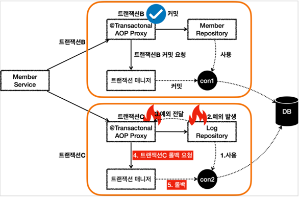

> [!NOTE]
> 
> 이 경우 회원은 저장되지만, 회원 이력 로그는 롤백된다.
> 따라서 `데이터 정합성` 문제가 발생할 수 있다.

## 트랜잭션 전파 활용3 - 단일 트랜잭션

#### Service: Transaction On, Repository: Transaction Off
- service가 시작할 때 모든 로직을 하나의 트랜잭션으로 묶인다.

```text
2023-10-10 21:47:30.166 DEBUG 62912 --- [    Test worker] o.s.orm.jpa.JpaTransactionManager        : Creating new transaction with name [hello.springtx.propogation.MemberService.joinV1]: PROPAGATION_REQUIRED,ISOLATION_DEFAULT
2023-10-10 21:47:30.166 DEBUG 62912 --- [    Test worker] o.s.orm.jpa.JpaTransactionManager        : Opened new EntityManager [SessionImpl(2122810288<open>)] for JPA transaction
2023-10-10 21:47:30.168 DEBUG 62912 --- [    Test worker] o.s.orm.jpa.JpaTransactionManager        : Exposing JPA transaction as JDBC [org.springframework.orm.jpa.vendor.HibernateJpaDialect$HibernateConnectionHandle@7c47b0f8]
2023-10-10 21:47:30.168 TRACE 62912 --- [    Test worker] o.s.t.i.TransactionInterceptor           : Getting transaction for [hello.springtx.propogation.MemberService.joinV1]
2023-10-10 21:47:30.173  INFO 62912 --- [    Test worker] h.springtx.propogation.MemberService     : == memberRepository 호출 시작 ==
2023-10-10 21:47:30.175  INFO 62912 --- [    Test worker] h.springtx.propogation.MemberRepository  : member 저장
2023-10-10 21:47:30.178 DEBUG 62912 --- [    Test worker] org.hibernate.SQL                        : call next value for hibernate_sequence
2023-10-10 21:47:30.202  INFO 62912 --- [    Test worker] h.springtx.propogation.MemberService     : == memberRepository 호출 종료 ==
2023-10-10 21:47:30.202  INFO 62912 --- [    Test worker] h.springtx.propogation.MemberService     : == logRepository 호출 시작 ==
2023-10-10 21:47:30.204  INFO 62912 --- [    Test worker] h.springtx.propogation.LogRepository     : log 저장
2023-10-10 21:47:30.204 DEBUG 62912 --- [    Test worker] org.hibernate.SQL                        : call next value for hibernate_sequence
2023-10-10 21:47:30.205  INFO 62912 --- [    Test worker] h.springtx.propogation.MemberService     : == logRepository 호출 종료 ==
2023-10-10 21:47:30.205 TRACE 62912 --- [    Test worker] o.s.t.i.TransactionInterceptor           : Completing transaction for [hello.springtx.propogation.MemberService.joinV1]
2023-10-10 21:47:30.205 DEBUG 62912 --- [    Test worker] o.s.orm.jpa.JpaTransactionManager        : Initiating transaction commit
2023-10-10 21:47:30.205 DEBUG 62912 --- [    Test worker] o.s.orm.jpa.JpaTransactionManager        : Committing JPA transaction on EntityManager [SessionImpl(2122810288<open>)]
2023-10-10 21:47:30.211 DEBUG 62912 --- [    Test worker] org.hibernate.SQL                        : insert into member (username, id) values (?, ?)
2023-10-10 21:47:30.213 DEBUG 62912 --- [    Test worker] org.hibernate.SQL                        : insert into log (message, id) values (?, ?)
2023-10-10 21:47:30.214 DEBUG 62912 --- [    Test worker] o.s.orm.jpa.JpaTransactionManager        : Closing JPA EntityManager [SessionImpl(2122810288<open>)] after transaction
2023-10-10 21:47:30.266 DEBUG 62912 --- [    Test worker] org.hibernate.SQL                        : select member0_.id as id1_1_, member0_.username as username2_1_ from member member0_ where member0_.username=?
2023-10-10 21:47:30.294 DEBUG 62912 --- [    Test worker] org.hibernate.SQL                        : select log0_.id as id1_0_, log0_.message as message2_0_ from log log0_ where log0_.message=?
```

#### Repository의 트랜잭션을 따로 분리하고 싶다면?
- 단순한 해결 방법은 트랜잭션이 있는 메서드와 없는 메서드를 따로 만들어서 호출 시점에 적절한 것을 선택하도록 설계해야 한다.
- 그러나 좋지 않은 방법이고, 이를 해결할 수 있는 것이 `트랜잭션 전파`를 활용하는 것이다.

## 트랜잭션 전파 활용4 - 전파 커밋

#### Service: Transaction On, Repository: Transaction On
- 모든 곳에 트랜잭션 어노테이션이 붙어있으므로 모든 논리 트랜잭션을 커밋해야 물리 트랜잭션도 커밋된다.
- 하나라도 롤백되면 물리 트랜잭션은 롤백된다.
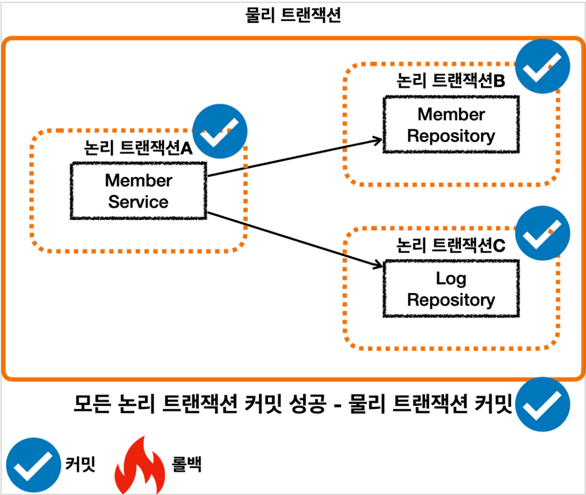
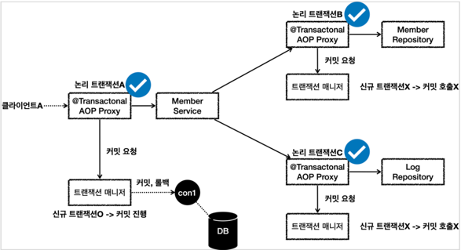

```text
2023-10-10 22:38:57.509 DEBUG 63641 --- [    Test worker] o.s.orm.jpa.JpaTransactionManager        : Creating new transaction with name [hello.springtx.propogation.MemberService.joinV1]: PROPAGATION_REQUIRED,ISOLATION_DEFAULT
2023-10-10 22:38:57.509 DEBUG 63641 --- [    Test worker] o.s.orm.jpa.JpaTransactionManager        : Opened new EntityManager [SessionImpl(349399986<open>)] for JPA transaction
2023-10-10 22:38:57.511 DEBUG 63641 --- [    Test worker] o.s.orm.jpa.JpaTransactionManager        : Exposing JPA transaction as JDBC [org.springframework.orm.jpa.vendor.HibernateJpaDialect$HibernateConnectionHandle@7b7b1448]
2023-10-10 22:38:57.511 TRACE 63641 --- [    Test worker] o.s.t.i.TransactionInterceptor           : Getting transaction for [hello.springtx.propogation.MemberService.joinV1]
2023-10-10 22:38:57.517  INFO 63641 --- [    Test worker] h.springtx.propogation.MemberService     : == memberRepository 호출 시작 ==
2023-10-10 22:38:57.517 DEBUG 63641 --- [    Test worker] o.s.orm.jpa.JpaTransactionManager        : Found thread-bound EntityManager [SessionImpl(349399986<open>)] for JPA transaction
2023-10-10 22:38:57.517 DEBUG 63641 --- [    Test worker] o.s.orm.jpa.JpaTransactionManager        : Participating in existing transaction
2023-10-10 22:38:57.518 TRACE 63641 --- [    Test worker] o.s.t.i.TransactionInterceptor           : Getting transaction for [hello.springtx.propogation.MemberRepository.save]
2023-10-10 22:38:57.520  INFO 63641 --- [    Test worker] h.springtx.propogation.MemberRepository  : member 저장
2023-10-10 22:38:57.523 DEBUG 63641 --- [    Test worker] org.hibernate.SQL                        : call next value for hibernate_sequence
2023-10-10 22:38:57.550 TRACE 63641 --- [    Test worker] o.s.t.i.TransactionInterceptor           : Completing transaction for [hello.springtx.propogation.MemberRepository.save]
2023-10-10 22:38:57.550  INFO 63641 --- [    Test worker] h.springtx.propogation.MemberService     : == memberRepository 호출 종료 ==
2023-10-10 22:38:57.550  INFO 63641 --- [    Test worker] h.springtx.propogation.MemberService     : == logRepository 호출 시작 ==
2023-10-10 22:38:57.550 DEBUG 63641 --- [    Test worker] o.s.orm.jpa.JpaTransactionManager        : Found thread-bound EntityManager [SessionImpl(349399986<open>)] for JPA transaction
2023-10-10 22:38:57.550 DEBUG 63641 --- [    Test worker] o.s.orm.jpa.JpaTransactionManager        : Participating in existing transaction
2023-10-10 22:38:57.551 TRACE 63641 --- [    Test worker] o.s.t.i.TransactionInterceptor           : Getting transaction for [hello.springtx.propogation.LogRepository.save]
2023-10-10 22:38:57.554  INFO 63641 --- [    Test worker] h.springtx.propogation.LogRepository     : log 저장
2023-10-10 22:38:57.554 DEBUG 63641 --- [    Test worker] org.hibernate.SQL                        : call next value for hibernate_sequence
2023-10-10 22:38:57.554 TRACE 63641 --- [    Test worker] o.s.t.i.TransactionInterceptor           : Completing transaction for [hello.springtx.propogation.LogRepository.save]
2023-10-10 22:38:57.554  INFO 63641 --- [    Test worker] h.springtx.propogation.MemberService     : == logRepository 호출 종료 ==
2023-10-10 22:38:57.555 TRACE 63641 --- [    Test worker] o.s.t.i.TransactionInterceptor           : Completing transaction for [hello.springtx.propogation.MemberService.joinV1]
2023-10-10 22:38:57.555 DEBUG 63641 --- [    Test worker] o.s.orm.jpa.JpaTransactionManager        : Initiating transaction commit
2023-10-10 22:38:57.555 DEBUG 63641 --- [    Test worker] o.s.orm.jpa.JpaTransactionManager        : Committing JPA transaction on EntityManager [SessionImpl(349399986<open>)]
2023-10-10 22:38:57.561 DEBUG 63641 --- [    Test worker] org.hibernate.SQL                        : insert into member (username, id) values (?, ?)
2023-10-10 22:38:57.564 DEBUG 63641 --- [    Test worker] org.hibernate.SQL                        : insert into log (message, id) values (?, ?)
2023-10-10 22:38:57.565 DEBUG 63641 --- [    Test worker] o.s.orm.jpa.JpaTransactionManager        : Closing JPA EntityManager [SessionImpl(349399986<open>)] after transaction
2023-10-10 22:38:57.621 DEBUG 63641 --- [    Test worker] org.hibernate.SQL                        : select member0_.id as id1_1_, member0_.username as username2_1_ from member member0_ where member0_.username=?
2023-10-10 22:38:57.647 DEBUG 63641 --- [    Test worker] org.hibernate.SQL                        : select log0_.id as id1_0_, log0_.message as message2_0_ from log log0_ where log0_.message=?
```

## 트랜잭션 전파 활용5 - 전파 롤백

#### 내부 논리 트랜잭션에서 예외가 발생한 경우
- rollback-only 마크를 트랜잭션 매니저에 남긴다.
- 따라서 물리 트랜잭션을 커밋하는 시점에 해당 마크때문에 물리 트랜잭션이 롤백된다.
> 현재 예제에서는 RuntimeException을 던지기 때문에 트랜잭션 매니저가 실제로 rollback-only 마크를 참고하지는 않는다.

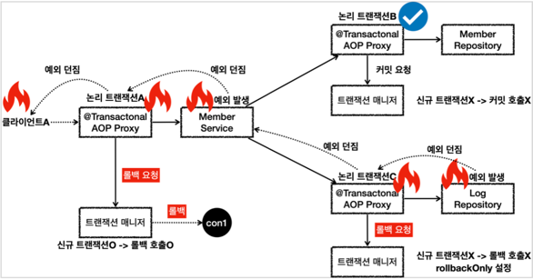

## 트랜잭션 전파 활용6 - 복구 REQUIRED

- 앞서 회원가입과 로그를 저장하는 과정을 하나의 트랜잭션으로 묶어서 데이터 정합성 문제를 해결했다.
- 그런데 로그를 기록하는 과정에 에러가 자주 발생하여 회원가입을 실패하는 경우가 많아졌고, 회원 이탈로 이어진다고 하자.
- 로그 기록을 추후에 복구할 수 있는 방식으로 교체를 한다고 하자.

#### 회원 가입을 시도한 로그를 남기는데, 실패하더라도 회원가입은 유지되도록 요구사항을 변경

> [!IMPORTANT]
> 
> 아래 코드를 보면, 로그를 기록하다가 예외가 발생하면 처리를 하고 정상흐름을 진행시킨다.
> 이렇게 된다면 회원가입은 정상적으로 진행되고 로그만 기록하는데 실패할 것 같다.(많은 개발자가 이 실수를 하니 조심하자.)
> 그러나 실제로는 커밋되지 않고 전체 트랜잭션이 롤백된다.

```java
    @Transactional
    public void joinV2(String username) {
        Member member = new Member(username);
        Log logMessage = new Log(username);

        log.info("== memberRepository 호출 시작 ==");
        memberRepository.save(member);
        log.info("== memberRepository 호출 종료 ==");

        log.info("== logRepository 호출 시작 ==");
        // 로그 저장에 실패해서 롤백하지 않도록
        try {
            logRepository.save(logMessage);
        } catch (RuntimeException e) {
            log.info("log 저장에 실패했습니다. logMessage={}", logMessage.getMessage());
            log.info("정상 흐름 반환");
        }
        log.info("== logRepository 호출 종료 ==");
    }
```

#### 내부 트랜잭션에서의 롤백
- 내부 트랜잭션에서 롤백이 발생하면 `rollback-only` 마크를 트랜잭션 매니저에게 기록하도록 한다.
- 따라서 우리가 예외를 처리하여 정상흐름으로 동작하도록 설계했더라도, 물리 트랜잭션이 커밋되는 시점에 해당 마크때문에 롤백되고 `UnexpectedRollbackException` 예외를 발생시킨다.
```text
2023-10-10 22:58:22.081  INFO 64153 --- [    Test worker] h.springtx.propogation.MemberService     : log 저장에 실패했습니다. logMessage=로그예외_recoverException_fail
2023-10-10 22:58:22.081  INFO 64153 --- [    Test worker] h.springtx.propogation.MemberService     : 정상 흐름 반환
2023-10-10 22:58:22.081  INFO 64153 --- [    Test worker] h.springtx.propogation.MemberService     : == logRepository 호출 종료 ==
2023-10-10 22:58:22.082 TRACE 64153 --- [    Test worker] o.s.t.i.TransactionInterceptor           : Completing transaction for [hello.springtx.propogation.MemberService.joinV2]
2023-10-10 22:58:22.082 DEBUG 64153 --- [    Test worker] o.s.orm.jpa.JpaTransactionManager        : Initiating transaction commit
2023-10-10 22:58:22.082 DEBUG 64153 --- [    Test worker] o.s.orm.jpa.JpaTransactionManager        : Committing JPA transaction on EntityManager [SessionImpl(179915314<open>)]
2023-10-10 22:58:22.082 DEBUG 64153 --- [    Test worker] cResourceLocalTransactionCoordinatorImpl : On commit, transaction was marked for roll-back only, rolling back
```

- 흐름
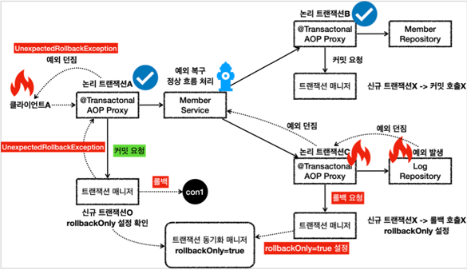